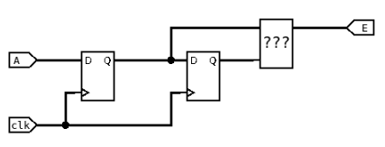

# TP_FPGA_Serine_Fakhri
## Petit projet : Écran magique
### Schéma explicatif de la problématique :

### Gestion des encodeurs :
* Explication de la détection d’un front montant ou descendant:

Le circuit de détection de front utilise deux bascules D (synchrones à l'horloge $clk$) montées en cascade afin de créer un décalage temporel du signal d'entrée $A$ . La sortie de la première bascule, $Q$, représente l'état du signal $A$ au cycle d'horloge précédent ($t-1$). La sortie de la deuxième bascule, $Q_{retardé}$ (entrée de la zone "???"), représente l'état du signal $A$ deux cycles avant ($t-2$). Pour détecter un front montant (passage de 0 à 1), on utilise la logique combinatoire $\text{Front Montant} = Q \text{ ET NON } Q_{retardé}$, ce qui vérifie que le signal est haut maintenant ($Q=1$) et qu'il était bas au cycle précédent ($Q_{retardé}=0$). Inversement, pour détecter un front descendant (passage de 1 à 0), on utilise la logique $\text{Front Descendant} = \text{NON } Q \text{ ET } Q_{retardé}$, ce qui vérifie que le signal est bas maintenant ($Q=0$) et qu'il était haut au cycle précédent ($Q_{retardé}=1$).

* Resultat :

