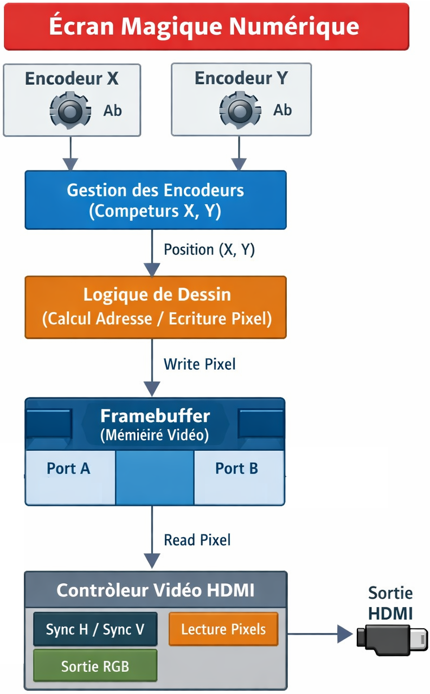
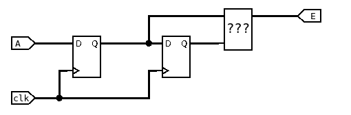
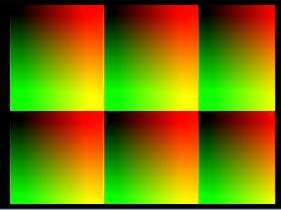
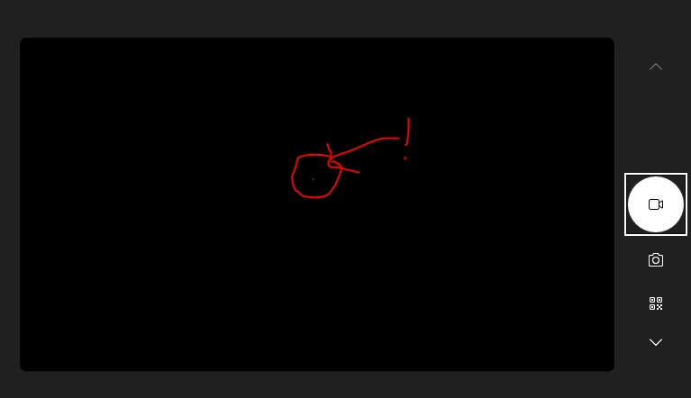
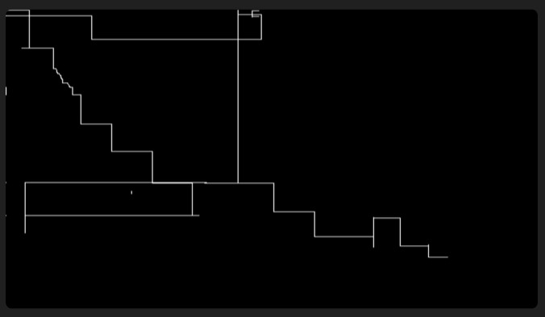
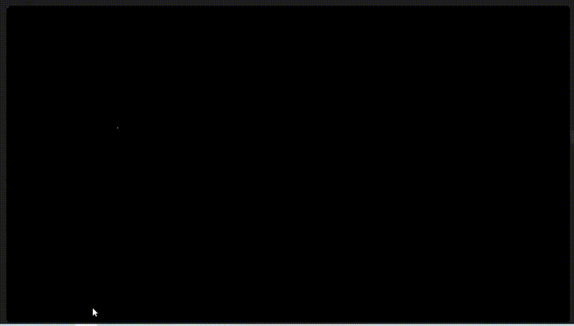
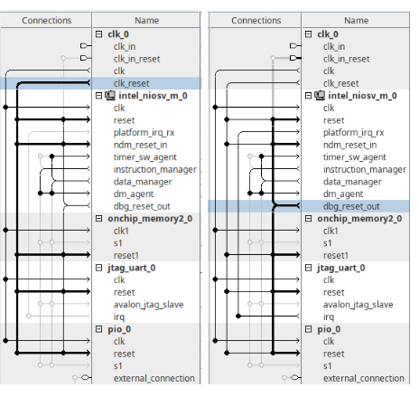
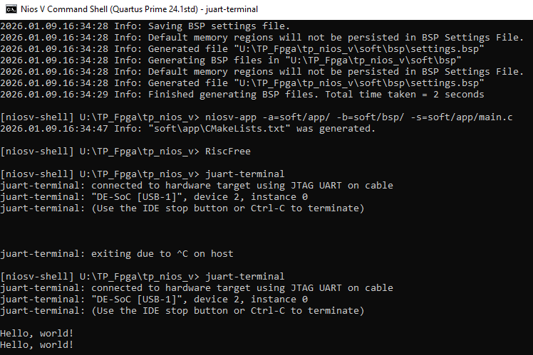

# TP_FPGA_Serine_Fakhri
## Petit projet : Écran magique
### Introduction:
Le projet consiste à réaliser une version numérique du « télécran », un dispositif permettant
de tracer un dessin en déplaçant un point lumineux. Dans notre implémentation, le déplacement
du “stylet” est assuré par les deux encodeurs incrémentaux présents sur la carte mezzanine, et
l’affichage est généré via la sortie HDMI de la carte DE10-Nano.
Le projet se déroule en plusieurs étapes progressives, chacune visant à développer un module
essentiel du système final. Pour chaque sous-partie, la méthodologie reste identique :

— concevoir un schéma ou une architecture répondant à la problématique ;

— implémenter la solution en VHDL ;

— simuler le fonctionnement pour validation ;

— tester la solution sur la carte FPGA.

L’objectif final est d’obtenir un affichage HDMI capable de montrer un pixel dont la position
dépend des mouvements des encodeurs, ainsi que de mémoriser le tracé complet à l’aide d’une
mémoire dual-port (DPRAM).

### Schéma explicatif de la problématique :


### Gestion des encodeurs :
* **Explication de la détection d’un front montant ou descendant :**



Le circuit utilise deux bascules D montées en série pour mémoriser l'état présent et l'état précédent du signal d'entrée A :
  - Première bascule D : Elle synchronise le signal d'entrée avec l'horloge (clk) et introduit un retard d'un cycle. Sa sortie représente l'état actuel échantillonné ($A_{n}$).
  - Deuxième bascule D : Elle retarde encore le signal d'un cycle. Sa sortie représente donc l'état que le signal avait au cycle précédent ($A_{n-1}$).

Le bloc "???" reçoit deux signaux : celui de la première bascule (état actuel) et celui de la deuxième bascule (état précédent). Pour détecter le front montant, il réalise l'opération suivante :
  - L'entrée du haut (état actuel) reste telle quelle.
  - L'entrée du bas (état précédent) passe par un inverseur (porte NOT).
  - Les deux sont reliés à une porte ET.

**Explication des encodeurs :**

Cette partie du TP se concentre sur le décodage des encodeurs incrémentaux en faisant abstraction de l'affichage, en utilisant les signaux A et B en quadrature pour déterminer le sens de rotation. L'objectif est de piloter un registre de 10 bits (visualisé sur les LED) qui s'incrémente vers la droite lors d'un front montant de A (si B=0) ou d'un front descendant de A (si B=1), et se décrémente vers la gauche lors d'un front montant de B (si A=0) ou d'un front descendant de B (si A=1). Cette logique, parfaitement exacte, permet de traduire chaque changement d'état physique en un déplacement précis du curseur pour le futur projet « télécran ».

**Resultat :**
  


### Contrôleur HDMI:
Cette étape a porté sur la conception d'un contrôleur d'affichage modulable, dont la résolution est configurable via des paramètres generics (h_res, v_res, etc.). Le cœur du système repose sur deux compteurs synchrones pilotant un balayage de type raster : le premier incrémente les pixels horizontalement tandis que le second gère le passage aux lignes verticales.

La gestion des signaux s'articule autour de trois axes principaux :
 - **Synchronisation et validation** : Les signaux o_hdmi_hs et o_hdmi_vs assurent la synchronisation temporelle, tandis que la combinaison des zones actives (r_h_active et r_v_active) génère le signal o_hdmi_de (Data Enable), indispensable pour valider l'affichage des pixels.
 - **Adressage mémoire** : Le contrôleur traduit les coordonnées cartésiennes $(X, Y)$ en une adresse linéaire pour la DPRAM via la formule $Pixel\_Address = X + (Y \times h\_res)$, garantissant un accès précis aux données stockées.
 - **Rendu matériel** : L'analyse du schéma RTL confirme une architecture robuste basée sur des comparateurs et registres, tandis que le format RGB 24 bits a été retenu pour assurer une restitution fidèle des couleurs
   
**À quels bits correspondent chaque composante couleur ?**
```vhdl
o_hdmi_tx_d(23 downto 16) <= std_logic_vector(to_unsigned(s_x_counter, 8));
o_hdmi_tx_d(15 downto 8)  <= std_logic_vector(to_unsigned(s_y_counter, 8));
o_hdmi_tx_d(7 downto 0)   <= (others => '0');
```
  * Les bits 23 à 16 correspondent à la composante rouge,
  * les bits 15 à 8 à la composante verte,
  * et les bits 7 à 0 à la composante bleue.

**Résultat de Mapping couleur :**



### Déplacement d'un pixel:
Cette phase du projet vise à asservir la position d'un pixel unique aux mouvements des deux encodeurs incrémentaux : l’encodeur de gauche commande l'axe horizontal ($X$) et celui de droite l'axe vertical ($Y$).

Le rendu visuel repose sur un test de comparaison en temps réel entre la position cible (fournie par les encodeurs) et le balayage actuel du contrôleur vidéo :
- **Condition d'allumage** : Si les coordonnées des compteurs de balayage (x_counter, y_counter) coïncident avec les valeurs stockées dans les registres des encodeurs, le signal de sortie o_hdmi_tx_d est forcé au blanc (x"FFFFFF").
- **Condition d'extinction** : Dans tous les autres cas, le signal est maintenu au noir (x"000000").Cette méthode permet de vérifier le bon fonctionnement de la chaîne complète, du décodage matériel des encodeurs jusqu'à la génération du signal HDMI, avant d'implémenter la mémorisation du tracé dans la DPRAM.
  


### Mémorisation:
**Qu’est-ce qu’une RAM dual-port ?**

Une mémoire Dual-Port est une unité de stockage (RAM) équipée de deux ports d’accès totalement indépendants (Port A et Port B). Chaque port possède ses propres ressources dédiées, ce qui permet des opérations simultanées sans conflit :
- **Signaux propres** : Chaque port dispose de son horloge, de son bus d'adresse, de ses données et de son signal de commande d'écriture.
- **Simultanéité** : Les deux ports peuvent lire ou écrire des données en même temps, de manière totalement asynchrone.



### Effacement:
- **Multiplexage de l’écriture dans la DPRAM** : Le Port A de la Dual-Port RAM
est utilisé pour deux opérations différentes : le tracé normal et l’effacement. La sélection
entre ces deux modes dépend de l’état de la machine d’états dédiée à l’effacement.
     - Mode Effacement : l’adresse provient du compteur d’effacement et la valeur écrite
est toujours x"00".
     - Mode Stylet : l’adresse provient de la position du curseur et la valeur écrite est x"FF"
lorsque l’utilisateur trace un point.

Cette approche permet d’utiliser efficacement un même port mémoire pour deux tâches
différentes sans conflit.
- **Machine d’états pour l’effacement** : L’effacement complet de la mémoire est réalisé
à travers une petite FSM composée de deux états : CLEAR_IDLE et CLEAR_RUN. Dans
l’état d’attente, un appui sur le bouton déclenche la procédure d’effacement. Dans l’état
d’exécution, la FSM incrémente séquentiellement l’adresse jusqu’à la dernière case de
la RAM. L’effacement prend plusieurs cycles d’horloge, mais il n’interrompt jamais la
lecture du Port B, ce qui permet au signal HDMI de rester parfaitement continu.



# Compte Rendu : TP FPGA Avancé - Implémentation d'un Soft-Processeur Nios V

## 1. Introduction

Ce compte rendu détaille les objectifs, la méthodologie et les réalisations du Travaux Pratiques (TP) axé sur l'implémentation et l'utilisation d'un soft-processeur Nios V sur une carte FPGA de type Cyclone V. Le TP vise à fournir une compréhension approfondie de l'intégration hardware/software, du développement de systèmes embarqués et de l'interaction avec des périphériques externes (LEDs, accéléromètre ADXL345).

## 2. Partie 1 : Implémentation du Soft-Processeur Nios V

### 2.1. Architecture et Outils

L'environnement de développement repose sur Quartus Prime pour la synthèse et la compilation du matériel, et Platform Designer pour la conception du soft-processeur. Le Nios V est configuré avec une mémoire on-chip, un JTAG UART pour la communication, et un contrôleur PIO pour interagir avec les LEDs de la carte.

**Mise en œuvre :**
1.  **Structure du Projet :** Organisation des fichiers en répertoires distincts (`rtl`, `synt`, `sim`, `sopc`, `soft`) pour la clarté et la gestion du projet.
2.  **Projet Quartus :** Création des fichiers `.qpf` et `.qsf` avec les assignations globales et les contraintes spécifiques à la carte (horloge, reset, LEDs).
3.  **Platform Designer :**
    *   Instanciation du processeur `Nios V/m Microcontroller`.
    *   Intégration d'une mémoire `On-Chip Memory` (128 KB) et d'un `JTAG UART`.
    *   Ajout d'un `PIO (Parallel I/O)` de 10 bits pour contrôler les LEDs.
    *   Configuration des interconnexions (horloge, reset, bus de données et d'instructions) entre le processeur et ses périphériques.
    *   Assignation des adresses de base et configuration du vecteur de reset.
    *   Génération du système en VHDL.



4.  **Intégration VHDL :** Inclusion du code HDL généré par Platform Designer dans le fichier VHDL de top-niveau du projet Quartus, et instanciation du soft-processeur.

### 2.2. Développement Logiciel

L'environnement de développement logiciel est géré par la chaîne d'outils Nios V et l'IDE RiscFree.

**Mise en œuvre :**
1.  **Création de la BSP :** Utilisation de `niosv-bsp` pour générer le Board Support Package, essentiel pour l'interaction entre le code C et le matériel Nios V.
2.  **Création de l'Application :** Génération de la structure de l'application C avec `niosv-app`.
3.  **IDE RiscFree :** Importation de la BSP et de l'application dans RiscFree pour l'édition, la compilation et le débogage du code.

### 2.3. Validation Initiale

#### 2.3.1. "Hello, world!"

**Objectif :** Vérifier le bon fonctionnement du soft-processeur et de la communication JTAG UART.

**Implémentation :** Un programme C simple affichant "Hello, world!" sur la console via `printf`.

**Observations :** Le message "Hello, world!" doit s'afficher correctement dans le terminal `juart-terminal` après la programmation et le lancement du code.



#### 2.3.2. Le "Chenillard"

**Objectif :** Tester le contrôle des GPIO (LEDs) depuis le code C.

**Implémentation :** Un programme C qui fait défiler une séquence lumineuse sur les 10 LEDs, en utilisant les macros d'accès au PIO (`IOWR_ALTERA_AVALON_PIO_DATA`) et des fonctions de délai (`usleep`).

**Observations :** Une séquence lumineuse (chenillard) doit être visible sur les LEDs de la carte FPGA.

```
#include <unistd.h> 
#include <stdint.h>

#include "system.h"
#include "altera_avalon_pio_regs.h"

int main(void)
{
const int NLEDS = 10;
const useconds_t DELAY_US = 100000; 

while (1)
{
// Aller : LED0 -> LED9
for (int i = 0; i < NLEDS; i++)
{
uint32_t pattern = (1u << i); // un seul bit à 1
IOWR_ALTERA_AVALON_PIO_DATA(PIO_0_BASE, pattern);
usleep(DELAY_US);
}

// Retour : LED8 -> LED1 (pour éviter de répéter LED9 puis LED0)
for (int i = NLEDS - 2; i >= 1; i--)
{
uint32_t pattern = (1u << i);
IOWR_ALTERA_AVALON_PIO_DATA(PIO_0_BASE, pattern);
usleep(DELAY_US);
}
}

return 0;
}
```


## 3. Partie 2 : Projets Embarqués avec Accéléromètre

Cette section explore l'intégration d'un capteur externe, l'accéléromètre ADXL345, pour des applications interactives.

### 3.1. Le Niveau à Bulles

**Objectif :** Développer une application affichant l'inclinaison de la carte sur les LEDs, simulant un niveau à bulles.

**Mise en œuvre :**

1.  **Extension du SOPC :** Ajout d'un contrôleur I2C (Avalon I2C (Master) Intel FPGA IP) au système Nios V dans Platform Designer.
2.  
3.  **Mise à jour Hardware/Software :** Intégration du contrôleur I2C au VHDL top-niveau et régénération/réimportation de la BSP et de l'application.
  
4.  **Communication I2C :**
    *   Utilisation des fonctions de la bibliothèque `altera_avalon_i2c.h` pour initialiser le bus I2C.
    *   Communication avec l'ADXL345 : lecture du registre `DEVID` pour validation, activation du capteur (`POWER_CTL`).
    *   Lecture des données d'accélération sur les axes X, Y, Z.
5.  **Application "Niveau à bulles" :** Interprétation des valeurs d'accélération pour déterminer l'inclinaison et allumer les LEDs correspondantes pour simuler le niveau.


